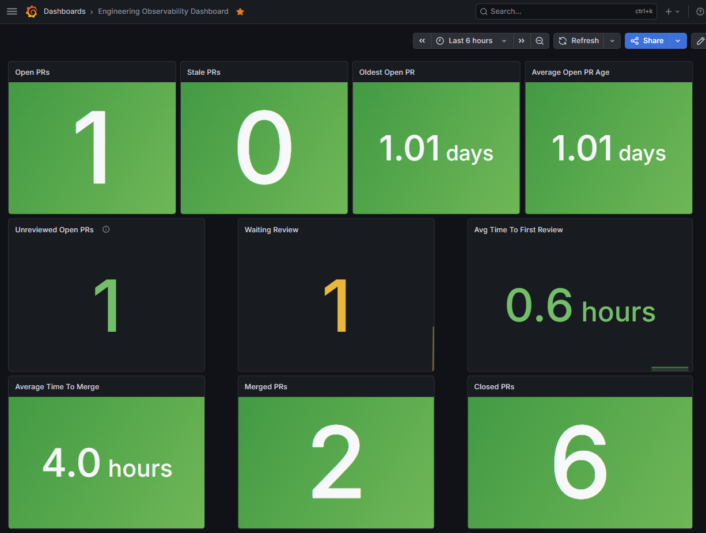

# Engineering Observability Dashboard

A lightweight engineering observability platform built using Go, GitHub GraphQL, Prometheus and Grafana.

## Dashboard Preview



## Overview

This project explores how engineering flow metrics can be collected from GitHub and visualised using open-source observability tooling.

The platform collects pull request data from GitHub using GraphQL, exposes custom Prometheus metrics through a Go exporter, stores metrics in Prometheus and visualises engineering insights in Grafana.

## Architecture

```text
GitHub GraphQL API
        ↓
Go Exporter
        ↓
Prometheus
        ↓
Grafana
```

## Current Metrics

### Pull Request Volume

* Open Pull Requests
* Closed Pull Requests
* Merged Pull Requests

### Pull Request Health

* Stale Pull Requests
* Oldest Open Pull Request
* Average Open Pull Request Age

### Review Flow

* Review Backlog
* Waiting For Review
* Average Time To First Review

### Delivery Flow

* Average Time To Merge

## Current Status

| Milestone                   | Status |
| --------------------------- | ------ |
| M1 Foundations              | ✅      |
| M2 GitHub GraphQL           | ✅      |
| M3 Docker & Prometheus      | ✅      |
| M4 Grafana Dashboard        | ✅      |
| M5 Engineering Flow Metrics | ✅      |
| M6 Dashboard Provisioning   | ✅      |
| M7 Java Exporter Spike | ✅ |

## Quick Start

```bash
git clone git@github.com:mike-rae/engineering-observability-dashboard.git
cd engineering-observability-dashboard

docker compose up --build -d
```

Open:

* Grafana: http://localhost:3000
* Prometheus: http://localhost:9090
* Metrics: http://localhost:2112/metrics

## Documentation

* [Setup Guide](docs/SETUP.md)
* [Project Journey](JOURNEY.md)

## Java Exporter

A Java exporter spike is available under:

```text
java-exporter/
```
The Java implementation currently supports:

* ```/health```
* ```/metrics```

Specific metrics are:
- GitHub pull request counts by state
- Open pull request age
- Stale pull request count

This Java implementation is intentionally smaller than the Go exporter and is used to compare Java and Go approaches for GitHub GraphQL and Prometheus metric export.

## Roadmap

### Milestone 7
* Java implementation

### Milestone 8
* Multi-repository support
* Team aggregation
* Historical trend analysis

### Milestone 9

* Go vs Java comparison
* Performance comparison
* Maintainability comparison

## Disclaimer

This project is a learning exercise in engineering observability, Go development and engineering flow metrics.
